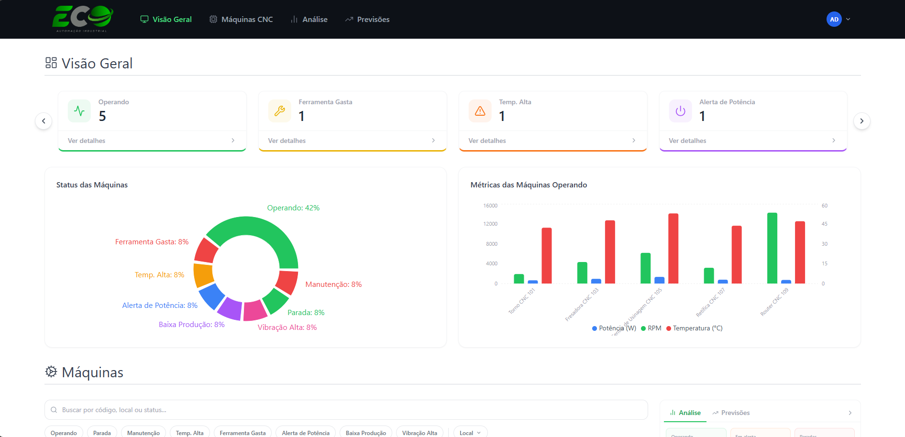

# Eco+ · Monitoramento de Máquinas Industriais

> Desafio técnico frontend — aplicação React para monitoramento e gestão de máquinas CNC em tempo real.



---

## Sumário

- [Sobre o Projeto](#sobre-o-projeto)
- [Stack & Decisões Técnicas](#stack--decisões-técnicas)
- [Arquitetura](#arquitetura)
- [Como Executar](#como-executar)
- [Deploy](#deploy)
- [Observações](#observações)

---

## Sobre o Projeto

O desafio consiste em construir uma aplicação web para **monitoramento e gestão de máquinas industriais**, consumindo dados de uma API REST. As funcionalidades principais são:

- Listagem de máquinas com agrupamento por status
- Exibição de detalhes, métricas e histórico de cada máquina
- Atualização de metadados (nome, descrição, localização)
- Dashboard com indicadores em tempo real
- Análises e previsões baseadas nos dados das máquinas

Uma tela de **login** foi adicionada por decisão própria — embora não pedida no enunciado, faz sentido em um sistema corporativo real. A autenticação é simples e baseada em variáveis de ambiente.

---

## Stack & Decisões Técnicas

| Tecnologia | Motivo da escolha |
|---|---|
| **React + Vite** | Build mais rápido, HMR eficiente, ecossistema atual e com suporte contínuo — preferível ao CRA |
| **Tailwind CSS** | Estilização por utilitários: produtividade alta, sem CSS customizado excessivo, fácil manutenção em componentes grandes |
| **Redux Toolkit** | Gerenciamento de estado global simplificado; API parecida com Pinia (Vue), o que reduziu a curva de aprendizado |
| **React Router v6** | Roteamento com suporte a rotas protegidas via `ProtectedRoute` / `PublicRoute` |
| **Recharts** | Gráficos e visualizações de dados com boa integração ao ecossistema React |
| **Sonner** | Toasts leves e acessíveis para feedback de ações do usuário |
| **Lucide React** | Ícones consistentes e tree-shakeable |

---

## Arquitetura

O projeto segue uma **arquitetura modular orientada a responsabilidade**, separando camadas de UI, estado, serviços e lógica de negócio de forma clara e escalável.

```
src/
├── assets/                  # Recursos estáticos
│   └── images/
│       └── machines/        # Imagens ilustrativas das máquinas
│
├── components/              # Componentes React reutilizáveis
│   ├── global/              # Componentes compartilhados (Header, Layout, etc.)
│   └── pages/               # Componentes específicos por página
│       ├── homeview/        # Dashboard principal
│       └── loginview/       # Tela de autenticação
│
├── hooks/                   # Custom hooks React
│   ├── auth/                # useAuth — autenticação e sessão
│   ├── global/              # Hooks utilitários globais
│   └── machines/            # useMachines — CRUD e métricas
│
├── pages/                   # Views da aplicação (composição de componentes)
│   ├── auth/                # LoginView
│   └── global/              # HomeView, MachinesCNCView, AnalysesView, ForecastsView…
│
├── plugin/                  # Instância do cliente HTTP e variáveis de ambiente
│
├── routes/                  # Roteamento (React Router) com rotas protegidas
│
├── services/                # Camada de comunicação com a API
│   ├── auth/                # Endpoints de autenticação
│   └── machines/            # Endpoints de máquinas (CRUD)
│
├── store/                   # Estado global (Redux Toolkit)
│   └── slices/              # Slices: auth, machines…
│
└── styles/                  # Estilos globais e configuração Tailwind
```

### Fluxo de dados

```
API REST
   │
   ▼
plugin/            ← instância axios com baseURL e headers via variáveis de ambiente
   │
   ▼
services/          ← funções de chamada HTTP (uma responsabilidade por arquivo)
   │
   ▼
store/slices/      ← Redux Toolkit — estado global, cache e status de carregamento
   │
   ▼
hooks/             ← interface reativa entre store e componentes
   │
   ▼
components/pages/  ← UI — consome hooks exclusivamente, nunca a store diretamente
```

> Cada `index.js` nas pastas-chave centraliza as exportações, permitindo imports limpos em linha única onde necessário.

### Roteamento

| Rota | Componente | Acesso |
|---|---|---|
| `/login` | `LoginView` | Público |
| `/` | `HomeView` | Autenticado |
| `/machinescnc` | `MachinesCNCView` | Autenticado |
| `/analyses` | `AnalysesView` | Autenticado |
| `/forecasts` | `ForecastsView` | Autenticado |
| `/perfil` | `ProfileView` | Autenticado |
| `/configuracoes` | `SettingsView` | Autenticado |
| `*` | Redireciona para `/not-found` | — |

Tentativas de acessar rotas protegidas sem autenticação exibem um toast de aviso e redirecionam para `/login`.

---

## Como Executar

### 1. Clone o repositório

```bash
git clone https://github.com/AnthonyLoche/EcoMais-Challenge.git
cd EcoMais-Challenge
```

### 2. Configure as variáveis de ambiente

Crie um arquivo `.env` na raiz do projeto:

```env
# URL base da API
VITE_REACT_APP_API_BASE_URL=https://webhook.ecoplus-apps.com/webhook

# Credenciais da API
VITE_REACT_APP_API_USER=eco_user
VITE_REACT_APP_API_PASS=enemy-banana-ahead
VITE_REACT_APP_API_KEY=enemy-banana-ahead

# Credenciais de login (apenas para simulação local)
VITE_REACT_APP_LOGIN_USER=admin@admin.com
VITE_REACT_APP_LOGIN_PASS=admin
```

> ⚠️ As credenciais de login são apenas para simular autenticação em desenvolvimento. Nunca exponha senhas reais em repositórios públicos.

### 3. Instale as dependências

```bash
npm install
```

### 4. Inicie o servidor de desenvolvimento

```bash
npm run dev
```

Acesse `http://localhost:3000/` e entre com:

```
Email: admin@admin.com
Senha: admin
```

---

## Deploy

O projeto está publicado via **Vercel**, com deploy automático a cada push na branch `main`.

🔗 **[eco-mais-challenge.vercel.app](https://eco-mais-challenge.vercel.app/)**

---

## Observações

O gif de carregamento foi gerado com inteligência artificial usando a logo da Eco+, para um toque personalizado na experiência inicial.


## Sobre o desafio:

Fico a disposição para esclarecer quaisquer dúvidas sobre as decisões técnicas, arquitetura ou implementação. Agradeço a oportunidade de participar deste processo seletivo e estou aberto a feedbacks construtivos para aprimorar ainda mais o projeto!

Contato:
- LinkedIn: [linkedin.com/in/anthony-loche](https://www.linkedin.com/in/anthony-reis-282663291/)
- Email: anthonylocheifc@gmail.com
- GitHub: [github.com/AnthonyLoche]
- Portfólio: [anthony-loche.dev](https://my-portfolio-anthonygabriel.vercel.app/)
- Telefone: (47) 99963-6618